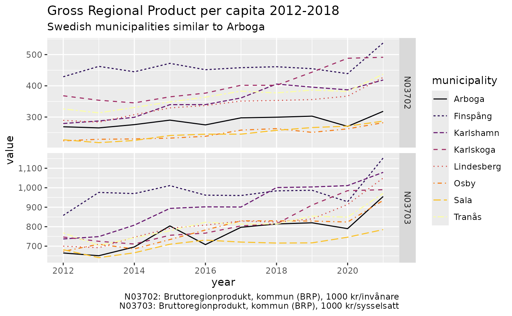

# Introduction to rKolada

`rKolada` is an R package for *downloading*, *inspecting* and
*processing* data from [Kolada](https://kolada.se/), a Key Performance
Indicator database for Swedish municipalities and regions. This vignette
provides an overview of the methods included in the `rKolada` package
and the design principles of the package API. To learn more about the
specifics of functions and to see a full list of the functions included,
please see the [Reference section of the package
homepage](https://lchansson.github.io/rKolada/reference/index.html) or
run `??rKolada`. For a quick introduction to the package see the
vignette [A quick start guide to
rKolada](https://lchansson.github.io/rKolada/articles/a-quickstart-rkolada.md).

NOTE: All metadata and data labels in Kolada are written in Swedish
only.

The design of `rKolada` functions is inspired by, and are supported by,
the design and functionality provided by several packages in the
`tidyverse` family. It is thus recommended that you install the
`tidyverse` package before installing rKolada:

``` r
install.packages("tidyverse")
install.packages("rKolada")
```

## Kolada, a Key Performance Indicator database for Swedish municipalities and regions

The Swedish Municipalities and Regions Database
[Kolada](https://kolada.se/) is a openly accessible, comprehensive
database containing over 4,000 Key Performance Indicators (KPIs) for a
vast number of aspects of municipal and regional organisations, politics
and economic life. The `rKolada` R package provides an interface to R
users to directly download, explore, and simplify metadata and data from
Kolada.

To get started with Kolada you might want to visit its homepage
(Swedish-only) or read through the [REST API documentation on
Github](https://github.com/Hypergene/kolada). However, you can also use
the `rKolada` package to explore data without prior knowledge of the
database.

``` r
library("rKolada")
```

### The data model

Data in Kolada are stored along three basic *dimensions*:

- A KPI ID
- A point in time (year)
- A municipality/region/ ID

When downloading data, the user needs to specify search parameters for
at least two of these three basic dimensions. (The Kolada API
documentation also specifies a fourth basic dimension: *gender*.
However, data for all genders is always automatically downloaded when
available.) The parameters can be a single, atomic value or a vector of
values.

Also, the Kolada database proves useful groupings of municipalities and
KPIs that can be used for further exploration, or to create unweighted
averages. Lastly, some KPIs are also available for *Organizational
units* (OUs) within municipalities, e.g. a school, an administrative
subdivision or an elderly home.

### Downloading data

If the user already has knowledge of the IDs of the KPIs and/or
municipalities they want to download, this can be done using the
function
[`get_values()`](https://lchansson.github.io/rKolada/reference/get_values.md).
For instance, if you want to download all values for the KPI `N00945`
(“Tillfälliga föräldrapenningdagar (VAB) som tas ut av män, andel av
antal dagar (%)”) for Sweden’s three most populous cities; Stockholm (id
`"0180"`), Gothenburg (Swedish: *Göteborg*; `"1480"`) and Malmö
(`"1280"`):

    #>       kpi municipality_id year count gender status    value municipality
    #> 1  N00945            0180 1996     1      T              NA    Stockholm
    #> 2  N00945            1280 1996     1      T              NA        Malmö
    #> 3  N00945            1480 1996     1      T              NA     Göteborg
    #> 4  N00945            0180 1997     1      T              NA    Stockholm
    #> 5  N00945            1280 1997     1      T              NA        Malmö
    #> 6  N00945            1480 1997     1      T              NA     Göteborg
    #> 7  N00945            0180 1998     1      T        30.41209    Stockholm
    #> 8  N00945            1280 1998     1      T        26.69198        Malmö
    #> 9  N00945            1480 1998     1      T        30.45307     Göteborg
    #> 10 N00945            0180 1999     1      T        30.62354    Stockholm
    #> 11 N00945            1280 1999     1      T        26.84941        Malmö
    #> 12 N00945            1480 1999     1      T        32.00700     Göteborg
    #> 13 N00945            0180 2000     1      T        31.32960    Stockholm
    #> 14 N00945            1280 2000     1      T        28.36723        Malmö
    #> 15 N00945            1480 2000     1      T        33.23952     Göteborg
    #> 16 N00945            0180 2001     1      T        31.90901    Stockholm
    #> 17 N00945            1280 2001     1      T        29.14839        Malmö
    #> 18 N00945            1480 2001     1      T        34.34883     Göteborg
    #> 19 N00945            0180 2002     1      T        33.13784    Stockholm
    #> 20 N00945            1280 2002     1      T        30.18228        Malmö
    #> 21 N00945            1480 2002     1      T        35.15515     Göteborg
    #> 22 N00945            0180 2003     1      T        33.82520    Stockholm
    #> 23 N00945            1280 2003     1      T        29.88630        Malmö
    #> 24 N00945            1480 2003     1      T        35.55795     Göteborg
    #> 25 N00945            0180 2004     1      T        34.21939    Stockholm
    #> 26 N00945            1280 2004     1      T        31.21299        Malmö
    #> 27 N00945            1480 2004     1      T        35.51597     Göteborg
    #> 28 N00945            0180 2005     1      T        35.00610    Stockholm
    #> 29 N00945            1280 2005     1      T        32.26879        Malmö
    #> 30 N00945            1480 2005     1      T        36.71541     Göteborg
    #> 31 N00945            0180 2006     1      T        35.78205    Stockholm
    #> 32 N00945            1280 2006     1      T        33.89914        Malmö
    #> 33 N00945            1480 2006     1      T        37.20446     Göteborg
    #> 34 N00945            0180 2007     1      T        35.61412    Stockholm
    #> 35 N00945            1280 2007     1      T        32.27672        Malmö
    #> 36 N00945            1480 2007     1      T        36.03724     Göteborg
    #> 37 N00945            0180 2008     1      T        36.34371    Stockholm
    #> 38 N00945            1280 2008     1      T        32.99687        Malmö
    #> 39 N00945            1480 2008     1      T        36.04195     Göteborg
    #> 40 N00945            0180 2009     1      T        36.59765    Stockholm
    #> 41 N00945            1280 2009     1      T        33.88994        Malmö
    #> 42 N00945            1480 2009     1      T        35.93543     Göteborg
    #> 43 N00945            0180 2010     1      T        36.92186    Stockholm
    #> 44 N00945            1280 2010     1      T        33.82857        Malmö
    #> 45 N00945            1480 2010     1      T        36.39835     Göteborg
    #> 46 N00945            0180 2011     1      T        37.04921    Stockholm
    #> 47 N00945            1280 2011     1      T        33.20278        Malmö
    #> 48 N00945            1480 2011     1      T        37.00446     Göteborg
    #> 49 N00945            0180 2012     1      T        37.04136    Stockholm
    #> 50 N00945            1280 2012     1      T        34.31265        Malmö
    #> 51 N00945            1480 2012     1      T        36.87452     Göteborg
    #> 52 N00945            0180 2013     1      T        38.35227    Stockholm
    #> 53 N00945            1280 2013     1      T        34.82378        Malmö
    #> 54 N00945            1480 2013     1      T        37.95666     Göteborg
    #> 55 N00945            0180 2014     1      T        38.61051    Stockholm
    #> 56 N00945            1280 2014     1      T        35.30861        Malmö
    #> 57 N00945            1480 2014     1      T        38.12922     Göteborg
    #> 58 N00945            0180 2015     1      T        39.09000    Stockholm
    #> 59 N00945            1280 2015     1      T        35.78000        Malmö
    #> 60 N00945            1480 2015     1      T        38.19000     Göteborg
    #> 61 N00945            0180 2016     1      T        38.79194    Stockholm
    #> 62 N00945            1280 2016     1      T        36.26382        Malmö
    #> 63 N00945            1480 2016     1      T        38.60823     Göteborg
    #> 64 N00945            0180 2017     1      T        38.93364    Stockholm
    #> 65 N00945            1280 2017     1      T        35.68866        Malmö
    #> 66 N00945            1480 2017     1      T        38.86796     Göteborg
    #> 67 N00945            0180 2018     1      T        39.40000    Stockholm
    #> 68 N00945            1280 2018     1      T        36.50000        Malmö
    #> 69 N00945            1480 2018     1      T        39.10000     Göteborg
    #> 70 N00945            0180 2019     1      T        39.30000    Stockholm
    #> 71 N00945            1280 2019     1      T        35.40000        Malmö
    #> 72 N00945            1480 2019     1      T        39.10000     Göteborg
    #> 73 N00945            0180 2020     1      T        40.80000    Stockholm
    #> 74 N00945            1280 2020     1      T        37.00000        Malmö
    #> 75 N00945            1480 2020     1      T        39.50000     Göteborg
    #>    municipality_type
    #> 1                  K
    #> 2                  K
    #> 3                  K
    #> 4                  K
    #> 5                  K
    #> 6                  K
    #> 7                  K
    #> 8                  K
    #> 9                  K
    #> 10                 K
    #> 11                 K
    #> 12                 K
    #> 13                 K
    #> 14                 K
    #> 15                 K
    #> 16                 K
    #> 17                 K
    #> 18                 K
    #> 19                 K
    #> 20                 K
    #> 21                 K
    #> 22                 K
    #> 23                 K
    #> 24                 K
    #> 25                 K
    #> 26                 K
    #> 27                 K
    #> 28                 K
    #> 29                 K
    #> 30                 K
    #> 31                 K
    #> 32                 K
    #> 33                 K
    #> 34                 K
    #> 35                 K
    #> 36                 K
    #> 37                 K
    #> 38                 K
    #> 39                 K
    #> 40                 K
    #> 41                 K
    #> 42                 K
    #> 43                 K
    #> 44                 K
    #> 45                 K
    #> 46                 K
    #> 47                 K
    #> 48                 K
    #> 49                 K
    #> 50                 K
    #> 51                 K
    #> 52                 K
    #> 53                 K
    #> 54                 K
    #> 55                 K
    #> 56                 K
    #> 57                 K
    #> 58                 K
    #> 59                 K
    #> 60                 K
    #> 61                 K
    #> 62                 K
    #> 63                 K
    #> 64                 K
    #> 65                 K
    #> 66                 K
    #> 67                 K
    #> 68                 K
    #> 69                 K
    #> 70                 K
    #> 71                 K
    #> 72                 K
    #> 73                 K
    #> 74                 K
    #> 75                 K

``` r
n00945 <- get_values(
  kpi = "N00945",
  municipality = c("0180", "1480", "1280"),
  period = 1970:2020
)

n00945
```

In many cases, however, you will not know in advance exactly what KPIs
to be looking for, or you might not know the IDs of Sweden’s
municipalities.

### Downloading metadata: `get` functions

Kolada has five different kinds of metadata entities Each one of these
can be downloaded by using `rKolada`’s `get` functions. Each function
returns a `tibble` with all available data for the specified metadata
entity:

- KPIs:
  [`get_kpi()`](https://lchansson.github.io/rKolada/reference/get_kpi.md)
- KPI groups:
  [`get_kpi_groups()`](https://lchansson.github.io/rKolada/reference/get_kpi.md)
- Municipalities:
  [`get_municipality()`](https://lchansson.github.io/rKolada/reference/get_kpi.md)
- Municipality groups:
  [`get_municipality_groups()`](https://lchansson.github.io/rKolada/reference/get_kpi.md)
- Organizational Unit: :
  [`get_ou()`](https://lchansson.github.io/rKolada/reference/get_kpi.md)

Each function returns a `tibble` with all available data for the
specified metadata entity.

    #>    auspices
    #> 1         E
    #> 2         X
    #> 3      <NA>
    #> 4      <NA>
    #> 5      <NA>
    #> 6         X
    #> 7      <NA>
    #> 8         X
    #> 9         X
    #> 10     <NA>
    #>                                                                                                                                                       description
    #> 1                                                      Personalkostnader kommunen totalt, dividerat med antal invånare totalt 31/12. Avser egen regi. Källa: SCB.
    #> 2                                                                     Kommunalekonomisk utjämning kommun, dividerat med antal invånare totalt 31/12 . Källa: SCB.
    #> 3      Externa intäkter exklusive intäkter från försäljning till andra kommuner och regioner för kommunen totalt, dividerat med antal invånare 31/12. Källa: SCB.
    #> 4                                                                              Inkomstutjämning, bidrag/avgift, i kronor per invånare den 1/11 fg år. Källa: SCB.
    #> 5                                                                         Kostnadsutjämning, bidrag/avgift, i kronor per invånare den 1/11 nov fg år. Källa: SCB.
    #> 6                                                                                      Regleringsbidrag/avgift, i kronor per invånare den 1/11 fg år. Källa: SCB.
    #> 7                                                                                                                 Utjämningssystemet enl SCB, kr/inv. Källa: SCB.
    #> 8                                                                                              Införandebidrag, i kronor per invånare den 1/11 fg år. Källa: SCB.
    #> 9                                                                                               Strukturbidrag, i kronor per invånare den 1/11 fg år. Källa: SCB.
    #> 10 Externa intäkter exklusive intäkter från försäljning till andra kommuner och regioner för egentlig verksamhet, dividerat med antal invånare 31/12. Källa: SCB.
    #>    has_ou_data     id is_divided_by_gender municipality_type
    #> 1        FALSE N00003                    0                 K
    #> 2        FALSE N00005                    0                 K
    #> 3        FALSE N00009                    0                 K
    #> 4        FALSE N00011                    0                 K
    #> 5        FALSE N00012                    0                 K
    #> 6        FALSE N00014                    0                 K
    #> 7        FALSE N00016                    0                 K
    #> 8        FALSE N00018                    0                 K
    #> 9        FALSE N00019                    0                 K
    #> 10       FALSE N00021                    0                 K
    #>            operating_area ou_publication_date perspective prel_publication_date
    #> 1  Kommunen, övergripande                <NA>    Resurser            2024-04-04
    #> 2   Skatter och utjämning                <NA>    Resurser            2024-04-04
    #> 3  Kommunen, övergripande                <NA>    Resurser                  <NA>
    #> 4   Skatter och utjämning                <NA>    Resurser            2023-09-28
    #> 5   Skatter och utjämning                <NA>    Resurser            2023-09-28
    #> 6   Skatter och utjämning                <NA>    Resurser            2023-09-28
    #> 7   Skatter och utjämning                <NA>    Resurser            2023-09-28
    #> 8   Skatter och utjämning                <NA>    Resurser            2023-09-28
    #> 9   Skatter och utjämning                <NA>    Resurser            2023-09-28
    #> 10 Kommunen, övergripande                <NA>    Resurser            2024-04-04
    #>    publ_period publication_date
    #> 1         2024       2025-02-22
    #> 2         2024       2025-02-22
    #> 3         2024       2025-02-22
    #> 4         2024       2024-04-15
    #> 5         2024       2024-04-15
    #> 6         2024       2024-04-15
    #> 7         2024       2024-04-15
    #> 8         2024       2024-04-15
    #> 9         2024       2024-04-15
    #> 10        2024       2025-02-22
    #>                                                  title
    #> 1                            Personalkostnader, kr/inv
    #> 2       Utjämningssystemet enl resultaträkning, kr/inv
    #> 3                     Intäkter kommunen totalt, kr/inv
    #> 4  Inkomstutjämning, bidrag/avgift, kr/inv 1 nov fg år
    #> 5             Kostnadsutjämning, bidrag/avgift, kr/inv
    #> 6              Regleringsbidrag/avgift, kr/inv (2005-)
    #> 7                   Utjämningssystemet enl SCB, kr/inv
    #> 8                      Införandebidrag, kr/inv (2005-)
    #> 9                       Strukturbidrag, kr/inv (2005-)
    #> 10                Intäkter egentlig verksamhet, kr/inv

``` r
# Download all KPI metadata as a tibble (kpi_df)
kpi_df <- get_kpi()

head(kpi_df, n = 10)
```

All `get` functions are thin wrappers around the more general function
[`get_metadata()`](https://lchansson.github.io/rKolada/reference/get_metadata.md).
If you are familiar with the terminology used in the Kolada API for
accessing metadata you might want to use this function instead.

### Exploring metadata

For each metadata type mentioned in the previous sections, `rKolada`
offers several convenience functions to help exploring and narrowing
down metadata tables. (If you are familiar with `dplyr` semantics, most
of these functions are basically wrappers around `dplyr`/`tidyr` code.)

Since each `get` function above returns a table for the selected entity,
a metadata table can be one of five different types. All metadata
convenience functions are prefixed to reflect which kind of metadata
table they operate on: `kpi`, `kpi_grp`, `municipality`,
`municipality_grp`, and `ou`.

All metadata convenience functions have been designed with functional
piping in mind, so their first argument is always a metadata tibble.
Most of them also return a tibble of the same type

The most important family of metadata convenience functions is the
`search` family. Much like
[`dplyr::filter()`](https://dplyr.tidyverse.org/reference/filter.html)
they can be used to search for one or several search terms in the entire
table or in a subset of named columns:

``` r
# Search for KPIs with the term "BRP" in their description or title
kpi_filter <- kpi_df %>% kpi_search("skola", column = c("description", "title"))
kpi_filter
#> # A tibble: 901 × 13
#>    auspices description has_ou_data id    is_divided_by_gender municipality_type
#>    <chr>    <chr>       <lgl>       <chr>                <int> <chr>            
#>  1 NA       "Kostnadsu… FALSE       N000…                    0 K                
#>  2 NA       "Kostnadsu… FALSE       N000…                    0 K                
#>  3 NA       "Kostnadsu… FALSE       N000…                    0 K                
#>  4 T        "Avvikelse… FALSE       N000…                    0 K                
#>  5 T        "Strukturk… FALSE       N001…                    0 K                
#>  6 E        "Antal ans… FALSE       N001…                    0 K                
#>  7 E        "Antal års… FALSE       N001…                    0 K                
#>  8 T        "Kommunind… FALSE       N003…                    0 K                
#>  9 T        "Kommunind… FALSE       N003…                    0 K                
#> 10 T        "Kommunind… FALSE       N003…                    0 K                
#> # ℹ 891 more rows
#> # ℹ 7 more variables: operating_area <chr>, ou_publication_date <chr>,
#> #   perspective <chr>, prel_publication_date <chr>, publ_period <chr>,
#> #   publication_date <chr>, title <chr>
```

    #> # A tibble: 3,312 × 3
    #>    id      members       title                                                
    #>    <chr>   <list>        <chr>                                                
    #>  1 G114418 <df [4 × 2]>  Fyrkommunsnätverket (ovägt medel)                    
    #>  2 G114419 <df [4 × 2]>  SMS - Samhällsskydd mellersta Skaraborg (ovägt medel)
    #>  3 G114798 <df [4 × 2]>  4M -  Fyra Mälarstäder (ovägt medel)                 
    #>  4 G114915 <df [68 × 2]> SmåKom (ovägt medel)                                 
    #>  5 G116237 <df [9 × 2]>  Sjuhärad kommunalförbund (ovägt medel)               
    #>  6 G116238 <df [15 × 2]> Skaraborgs kommunalförbund (ovägt medel)             
    #>  7 G122469 <df [10 × 2]> Region 10 (ovägt medel)                              
    #>  8 G122931 <df [5 × 2]>  3KVH (ovägt medel)                                   
    #>  9 G128518 <df [11 × 2]> Familjen Helsingborg (ovägt medel)                   
    #> 10 G128681 <df [12 × 2]> Stor-Malmö (ovägt medel)                             
    #> # ℹ 3,302 more rows

``` r
# Search for municipality groups containing the name "Arboga"
munic_g <- get_municipality_groups()
```

``` r
arboga_groups <- munic_g %>% municipality_grp_search("Arboga")
arboga_groups
#> # A tibble: 11 × 3
#>    id      members      title                                             
#>    <chr>   <list>       <chr>                                             
#>  1 G175909 <df [7 × 2]> Liknande kommuner ekonomiskt bistånd, Arboga, 2022
#>  2 G176199 <df [7 × 2]> Liknande kommuner socioekonomi, Arboga, 2022      
#>  3 G176489 <df [7 × 2]> Liknande kommuner äldreomsorg, Arboga, 2022       
#>  4 G35869  <df [7 × 2]> Liknande kommuner grundskola, Arboga, 2022        
#>  5 G36161  <df [7 × 2]> Liknande kommuner gymnasieskola, Arboga, 2022     
#>  6 G36453  <df [7 × 2]> Liknande kommuner IFO, Arboga, 2022               
#>  7 G37329  <df [7 × 2]> Liknande kommuner, övergripande, Arboga, 2022     
#>  8 G39502  <df [7 × 2]> Liknande kommuner LSS, Arboga, 2022               
#>  9 G85463  <df [7 × 2]> Liknande kommuner fritidshem, Arboga, 2022        
#> 10 G85755  <df [7 × 2]> Liknande kommuner förskola, Arboga, 2022          
#> 11 G87629  <df [7 × 2]> Liknande kommuner integration, Arboga, 2022
```

Another important family of exploration functions is the `describe`
family of functions. These functions take a metadata table and print a
human-readable summary of the most important facts about each row in the
table (up to a limit, specified by `max_n`). By default, output is
printed directly to the R console. But by specifying `format = "md"` you
can make the `describe` functions create markdown-ready output which can
be added directly to a R markdown file by setting the chunk option
`results='asis'`. The output then looks as follows:

``` r
kpi_filter %>% kpi_describe(max_n = 2, format = "md", heading_level = 4)
```

#### N00022: Kostnadsutjämningsnetto förskola och skolbarnsomsorg, kr/inv 1 nov fg år

##### Description

Kostnadsutjämningsnetto förskola och skolbarnomsorg beräknas som
kommunens standardkostnad minus standardkostnaden för riket i tkr
dividerat med antal invånare totalt 1/11 nov fg år. Källa: SCB.

##### Metadata

- Has OU data: FALSE

- Divided by gender: FALSE

- Municipality type: K

- Operating area: Skatter och utjämning

- Auspice: Unknown

- Publication date: 2024-04-15

- Publication period: 2024

##### Keywords

Unknown

#### N00023: Kostnadsutjämningsnetto grundskola, kr/inv 1 nov fg år

##### Description

Kostnadsutjämningsnetto grundskola beräknas som kommunens
standardkostnad minus standardkostnad för riket i tkr dividerat med
antal invånare totalt 1/11 fg år. Källa: SCB.

##### Metadata

- Has OU data: FALSE

- Divided by gender: FALSE

- Municipality type: K

- Operating area: Skatter och utjämning

- Auspice: Unknown

- Publication date: 2024-04-15

- Publication period: 2024

##### Keywords

Unknown

### Extra functions for exploring KPI metadata

KPI metadata is considerably more complex than other types of metadata.
To further assist in exploring KPI metadata the function
[`kpi_bind_keywords()`](https://lchansson.github.io/rKolada/reference/kpi_bind_keywords.md)
can be used to tag data with keywords (these are inferred from the KPI
title) to classify KPIs and make them more searchable.

``` r
# Add keywords to a KPI table
kpis_with_keywords <- kpi_filter %>% kpi_bind_keywords(n = 4)

# count keywords
kpis_with_keywords %>%
  tidyr::pivot_longer(dplyr::starts_with("keyword"), values_to = "keyword") %>%
  dplyr::count(keyword, sort = TRUE)
#> # A tibble: 417 × 2
#>    keyword            n
#>    <chr>          <int>
#>  1 elever           176
#>  2 grundskola       146
#>  3 gymnasieelever   112
#>  4 pedagogisk       112
#>  5 åk               112
#>  6 gymnasieskola    100
#>  7 förskola          91
#>  8 personal          87
#>  9 år                73
#> 10 kommunal          67
#> # ℹ 407 more rows
```

Some KPIs can be very similar-looking and it can sometimes be hard to
discern which of the KPIs to use. To make sifting through data easier,
[`kpi_minimize()`](https://lchansson.github.io/rKolada/reference/kpi_minimize.md)
can be used to remove all redundant columns from a KPI table. (In this
case, “redundant” means “containing no information that helps in
differentiating KPIs from one another”, i.e. columns containing only one
single value for all observations in the table):

``` r
# Top 10 rows of the table
kpi_filter %>% dplyr::slice(1:10)
#> # A tibble: 10 × 13
#>    auspices description has_ou_data id    is_divided_by_gender municipality_type
#>    <chr>    <chr>       <lgl>       <chr>                <int> <chr>            
#>  1 NA       "Kostnadsu… FALSE       N000…                    0 K                
#>  2 NA       "Kostnadsu… FALSE       N000…                    0 K                
#>  3 NA       "Kostnadsu… FALSE       N000…                    0 K                
#>  4 T        "Avvikelse… FALSE       N000…                    0 K                
#>  5 T        "Strukturk… FALSE       N001…                    0 K                
#>  6 E        "Antal ans… FALSE       N001…                    0 K                
#>  7 E        "Antal års… FALSE       N001…                    0 K                
#>  8 T        "Kommunind… FALSE       N003…                    0 K                
#>  9 T        "Kommunind… FALSE       N003…                    0 K                
#> 10 T        "Kommunind… FALSE       N003…                    0 K                
#> # ℹ 7 more variables: operating_area <chr>, ou_publication_date <chr>,
#> #   perspective <chr>, prel_publication_date <chr>, publ_period <chr>,
#> #   publication_date <chr>, title <chr>

# Top 10 rows of the table, with non-distinct data removed
kpi_filter %>% dplyr::slice(1:10) %>% kpi_minimize()
#> # A tibble: 10 × 9
#>    id     title                  description auspices operating_area perspective
#>    <chr>  <chr>                  <chr>       <chr>    <chr>          <chr>      
#>  1 N00022 Kostnadsutjämningsnet… "Kostnadsu… NA       Skatter och u… Resurser   
#>  2 N00023 Kostnadsutjämningsnet… "Kostnadsu… NA       Skatter och u… Resurser   
#>  3 N00026 Kostnadsutjämningsnet… "Kostnadsu… NA       Skatter och u… Resurser   
#>  4 N00097 Nettokostnadsavvikels… "Avvikelse… T        Kommunen, öve… Resurser   
#>  5 N00100 Strukturkostnad kommu… "Strukturk… T        Kommunen, öve… Resurser   
#>  6 N00108 Månadsavlönad persona… "Antal ans… E        Barn och utbi… Resurser   
#>  7 N00114 Årsarbetare inom förs… "Antal års… E        Barn och utbi… Resurser   
#>  8 N00300 Medborgarengagemang o… "Kommunind… T        Kommunen, öve… Kvalitet o…
#>  9 N00301 Trygghet och säkerhet… "Kommunind… T        Kommunen, öve… Kvalitet o…
#> 10 N00303 Tillgänglighet till t… "Kommunind… T        Kommunen, öve… Kvalitet o…
#> # ℹ 3 more variables: prel_publication_date <chr>, publ_period <chr>,
#> #   publication_date <chr>
```

Note that
[`kpi_minimize()`](https://lchansson.github.io/rKolada/reference/kpi_minimize.md)
operates on the *current table*. This means that results may vary
depending on the data you’re operating on.

### Metadata groups

Kolada provides pre-defined *groups* of KPIs and municipalities/regions.
Exploring an using thse groups can facilitate meaningful comparisons
between different entities or help paint a broader picture of
developments in a certain field or area.

To `get`, `search` or `describe` group metadata, use the same techniques
as described above for regular metadata (relevant prefixes are
`kpi_grp_` and `municipality_grp_`).

A crucial difference between group metadata and other metadata tables,
however, is that group metadata comes in the form of a
[nested](https://tidyr.tidyverse.org/articles/nest.html) table.
Typically you might want to *unnest* the groups in a group metadata
table once yo hae found the relevant group(s) for your query. To do
this, use the `unnest` functions to create a table containing unnested
entities, e.g. running `kpi_grp_unnest(kpi_grp_df)` using a KPI group
metadata table as argument creates a `kpi_df` that can be further
processed using the `kpi_` functios described in previous sections of
this vignette.

## Downloading data using metadata

An alternative approach to downloading data using known IDs is to use
metadata tables to construct arguments to
[`get_values()`](https://lchansson.github.io/rKolada/reference/get_values.md).
`rKolada` provides a `extract_ids` family of functions for passing a
metadata table as an argument to `get_values`. A typical workflow would
be to download metadata for (groups of) KPIs and/or municipalities, use
functions like
[`kpi_search()`](https://lchansson.github.io/rKolada/reference/kpi_search.md)
to filter down the tables to a few rows, and then call
[`get_values()`](https://lchansson.github.io/rKolada/reference/get_values.md)
to fetch data.

As an example, let’s say we want to download all KPIs describing Gross
Regional Product for all municipalities that are socioeconomically
similar to Arboga, a small municipality in central Sweden:

``` r
# Get KPIs describing Gross Regional Product of municipalities
kpi_filter <- get_kpi() %>% 
  kpi_search("bruttoregionprodukt") %>%
  kpi_search("K", column = "municipality_type")
# Creates a table with two rows

# Get a suitable group of municipalities
munic_grp_filter <- get_municipality_groups() %>% 
  municipality_grp_search("Liknande kommuner socioekonomi, Arboga")
# Creates a table with one group of 7 municipalities

# Also include Arboga itself
arboga <- get_municipality() %>% municipality_search("Arboga")

# Get data
grp_data <- get_values(
  kpi = kpi_extract_ids(kpi_filter),
  municipality = c(
    municipality_grp_extract_ids(munic_grp_filter),
    municipality_extract_ids(arboga)
  )
)
```

``` r
# Visualize results
library("ggplot2")
ggplot(grp_data, aes(year, value, color = municipality)) +
  geom_line(aes(linetype = municipality)) +
  facet_grid(kpi ~ ., scales = "free") +
  labs(
    title = "Gross Regional Product per capita 2012-2018",
    subtitle = "Swedish municipalities similar to Arboga",
    caption = values_legend(grp_data, kpi_filter)
  ) +
  scale_color_viridis_d(option = "B") +
  scale_y_continuous(labels = scales::comma)
```


