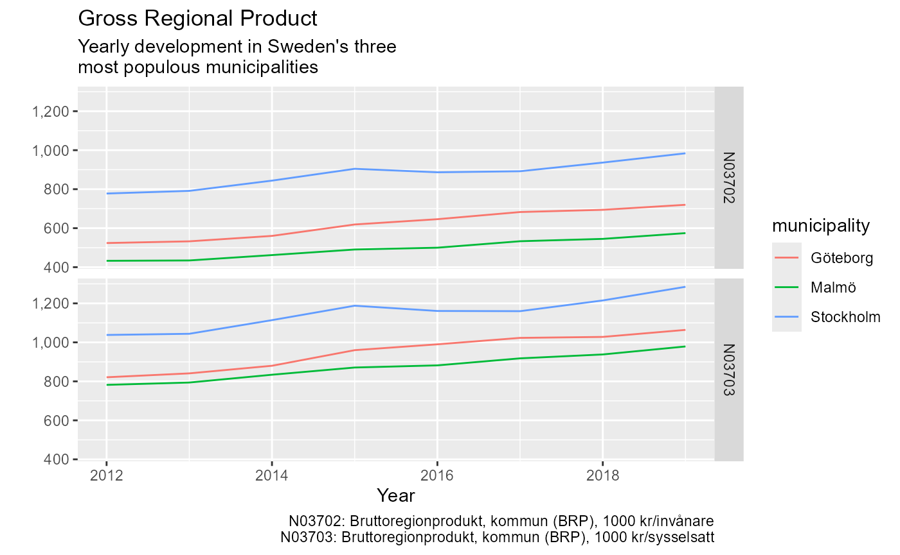

# A quick start guide to rKolada

This vignette provides a quick start guide to get up and running with
rKolada as fast as possible. For a more comprehensive introduction to
the rKolada package, see [Introduction to
rKolada](https://lchansson.github.io/rKolada/articles/introduction-to-rkolada.md).

``` r
library("rKolada")
```

In this guide we walk you through five steps to download, inspect and
search through Kolada metadata. We then use our search results to
download data from Kolada and plot it.

### 1. Get metadata

Kolada contains five different types of metadata entities:

1.  `kpi`: Key Performance Indicators
2.  `municipality`: Municipalities
3.  `ou`: Operating Unit, a subunit of municipalities
4.  `kpi_groups`: Thematic groupings of KPIs
5.  `municipality_groups`: Thematic groupings of municipalities

To obtain data using `rKolada` it is usually a good idea to start by
exploring metadata. `rKolada` comes with convenience functions for each
of the five above mentioned entities. These functions are all names
`get_[entity]()` and can be called as follows. The `cache` parameter
allows you to temporarily store results on disk to avoid repeated calls
to the API in case you need to re-run your code:

``` r
kpis <- get_kpi(cache = FALSE)
munic <- get_municipality(cache = FALSE)
```

If you have already familiarised yourself with the Kolada API (e.g. by
reading the [official docs on
GitHub](https://github.com/Hypergene/kolada)) you can access the full
metadata API using
[`get_metadata()`](https://lchansson.github.io/rKolada/reference/get_metadata.md).

### 2. Search metadata

Metadata tables are stored as regular `tibble`s so you can start
inspecting them by simply viewing them in RStudio. For example, the KPI
metadata we downloaded looks like this:

``` r
dplyr::glimpse(kpis)
#> Rows: 6,433
#> Columns: 13
#> $ auspices              <chr> "E", "X", NA, NA, NA, "X", NA, "X", "X", NA, NA,…
#> $ description           <chr> "Personalkostnader kommunen totalt, dividerat me…
#> $ has_ou_data           <lgl> FALSE, FALSE, FALSE, FALSE, FALSE, FALSE, FALSE,…
#> $ id                    <chr> "N00003", "N00005", "N00009", "N00011", "N00012"…
#> $ is_divided_by_gender  <int> 0, 0, 0, 0, 0, 0, 0, 0, 0, 0, 0, 0, 0, 0, 0, 0, …
#> $ municipality_type     <chr> "K", "K", "K", "K", "K", "K", "K", "K", "K", "K"…
#> $ operating_area        <chr> "Kommunen, övergripande", "Skatter och utjämning…
#> $ ou_publication_date   <chr> NA, NA, NA, NA, NA, NA, NA, NA, NA, NA, NA, NA, …
#> $ perspective           <chr> "Resurser", "Resurser", "Resurser", "Resurser", …
#> $ prel_publication_date <chr> "2024-04-04", "2024-04-04", NA, "2023-09-28", "2…
#> $ publ_period           <chr> "2024", "2024", "2024", "2024", "2024", "2024", …
#> $ publication_date      <chr> "2025-02-22", "2025-02-22", "2025-02-22", "2024-…
#> $ title                 <chr> "Personalkostnader, kr/inv", "Utjämningssystemet…
```

But `rKolada` also comes with a set of convenience functions to simplify
the task of exploring KPI metadata.
[`kpi_search()`](https://lchansson.github.io/rKolada/reference/kpi_search.md)
filters down a list of KPIs using a search term, and
[`kpi_minimize()`](https://lchansson.github.io/rKolada/reference/kpi_minimize.md)
can be used to clean the KPI metadata table from columns that don’t
contain any information that distinguish KPIs from each other:

``` r
# Get a list KPIs matching a search for "bruttoregionprodukt" (Gross regional product)
kpi_res <- kpis %>%
  kpi_search("bruttoregionprodukt") %>%
  # Keep only KPIs with data for the municipality level
  kpi_search("K", column = "municipality_type") %>%
  kpi_minimize(remove_monotonous_data = TRUE)

dplyr::glimpse(kpi_res)
#> Rows: 3
#> Columns: 7
#> $ id               <chr> "N00370", "N03702", "N03703"
#> $ title            <chr> "Ekonomisk hållbarhet - Kommunindex", "Bruttoregionpr…
#> $ description      <chr> "Kommunindex för tema Ekonomisk hållbarhet baseras på…
#> $ operating_area   <chr> "Befolkning", "Bakgrund", "Bakgrund"
#> $ perspective      <chr> "Kvalitet och resultat", "Volymer", "Volymer"
#> $ publ_period      <chr> "2023", "2024", "2022"
#> $ publication_date <chr> "2024-05-15", "2025-02-22", "2025-01-09"
```

Let’s say we are interested in retrieving data for three Swedish
municipalities. We thus want to create a table containing metadata about
these four municipalities:

``` r
munic_res <- munic %>% 
  # Only keep municipalities (drop regions)
  municipality_search("K", column = "type") %>% 
  # Only keep Stockholm, Gothenburg and Malmö
  municipality_search(c("Stockholm", "Göteborg", "Malmö"))

dplyr::glimpse(munic_res)
#> Rows: 3
#> Columns: 3
#> $ id    <chr> "1480", "1280", "0180"
#> $ title <chr> "Göteborg", "Malmö", "Stockholm"
#> $ type  <chr> "K", "K", "K"
```

### 3. Describe KPIs

In addition to the information provided about every KPI in the `title`
and `description` columns of a KPI table,
[`kpi_bind_keywords()`](https://lchansson.github.io/rKolada/reference/kpi_bind_keywords.md)
can be used to create a rough summary of every KPI creating a number of
*keyword* columns. The function
[`kpi_describe()`](https://lchansson.github.io/rKolada/reference/kpi_describe.md)
can be used to print a huamn readable table containing a summary of a
table of KPIs. For instance, by setting the `knitr` chunk option
`results='asis'`, the following code renders a Markdown section that is
automatically inluded as a part of the HTML that renders this web page:

``` r
kpi_res %>%
  kpi_bind_keywords(n = 4) %>% 
  kpi_describe(max_n = 1, format = "md", heading_level = 4, sub_heading_level = 5)
```

#### N00370: Ekonomisk hållbarhet - Kommunindex

##### Description

Kommunindex för tema Ekonomisk hållbarhet baseras på Genomsnittlig
allmän pensionsavgift, kr/invånare 20-64 år. Bruttoregionprodukt 1000
kr/invånare, Finansiella kapitalvinster/förluster, medelvärde i
befolkningen, kronor, Kapitalvinster/förluster vid försäljning av
fastighet och bostadsrätt, medelvärde i befolkningen, kronor samt
Individer med kapitalvinst/förlust, andel (%). Nyckeltalen normaliseras
så att alla kommunernas värden placeras på en skala från 0 till 100 där
0 är sämst och 100 är bäst (för vissa indikatorer används inverterad
skala). I nästa steg vägs de standardiserade indikatorvärdena samman
till index på aspektnivå (temat bygger i dagsläget på indikatorer inom
tre aspekter). Detta görs med medelvärden, samtliga indikatorer vägs
samman med samma vikt inom respektive aspekt. Värdena hamnar även på
denna nivå i intervallet 0 till 100. Därefter vägs indexet på aspektnivå
ihop till temanivå enligt samma princip och även dessa värden hamnar
mellan 0 och 100. Viktningen är lika stor för samtliga aspekter inom
temat. Källa: Tillväxtverkets beräkningar

##### Metadata

- Has OU data: Unknown

- Divided by gender: Unknown

- Municipality type: Unknown

- Operating area: Befolkning

- Auspice: Unknown

- Publication date: 2024-05-15

- Publication period: 2023

##### Keywords

- ekonomisk
- hållbarhet
- kommunindex

### 4. Get data

Once we have settled on what KPIs we are interested in the next step is
to download actual data from Kolada. Use
[`get_values()`](https://lchansson.github.io/rKolada/reference/get_values.md)
to do this. To download data from the Kolada API you need to provide at
least two of the following parameters:

1.  `kpi`: One or a vector of several KPI IDs
2.  `municipality`: One or a vector of several municipality IDs or
    municipality group IDs
3.  `period`: The years for which data should be downloaded.

The ID tags for KPIs and municipalities can be extracted using the
convenience functions
[`kpi_extract_ids()`](https://lchansson.github.io/rKolada/reference/kpi_extract_ids.md)
and
[`municipality_extract_ids()`](https://lchansson.github.io/rKolada/reference/municipality_extract_ids.md):

``` r
kld_data <- get_values(
  kpi = kpi_extract_ids(kpi_res),
  municipality = municipality_extract_ids(munic_res),
  period = 1990:2019,
  simplify = TRUE
)
```

Setting the `simplify` parameter to `TRUE`, again, makes results more
human readable, by removing undocumented columns and relabeling data
with human-friendly labels.

### 5. Inspect and visualise results

Finally, time to inspect our data:

``` r
# Visualise results
library("ggplot2")

ggplot(kld_data, aes(x = year, y = value)) +
  geom_line(aes(color = municipality)) +
  facet_grid(kpi ~ .) +
  scale_y_continuous(labels = scales::comma) +
  labs(
    title = "Gross Regional Product",
    subtitle = "Yearly development in Sweden's three\nmost populous municipalities",
    x = "Year",
    y = "",
    caption = values_legend(kld_data, kpis)
  )
```



Note the use of the helper function
[`values_legend()`](https://lchansson.github.io/rKolada/reference/values_legend.md)
to produce a legend containing the names and keys of all KPIs included
in the graph.
