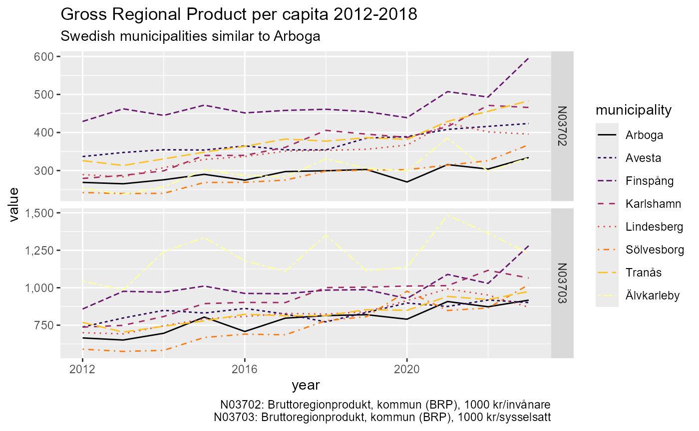

# Introduction to rKolada

`rKolada` is an R package for *downloading*, *inspecting* and
*processing* data from [Kolada](https://kolada.se/), a Key Performance
Indicator database for Swedish municipalities and regions. This vignette
provides an overview of the methods included in the `rKolada` package
and the design principles of the package API. To learn more about the
specifics of functions and to see a full list of the functions included,
please see the [Reference section of the package
homepage](https://lchansson.github.io/rKolada/reference/index.html) or
run `??rKolada`. For a quick introduction to the package see the
vignette [A quick start guide to
rKolada](https://lchansson.github.io/rKolada/articles/a-quickstart-rkolada.md).

> **Important:** All metadata and data labels in Kolada are in Swedish
> only. Function names and parameters are in English, but KPI titles,
> municipality names, and descriptions will be in Swedish.

The design of `rKolada` functions is inspired by the design and
functionality provided by several packages in the `tidyverse` family.
rKolada uses the base R pipe (`|>`) throughout. Some vignette examples
use `dplyr`, `tidyr`, and `ggplot2` for data wrangling and
visualisation:

``` r

install.packages("rKolada")
```

## Kolada, a Key Performance Indicator database for Swedish municipalities and regions

The Swedish Municipalities and Regions Database
[Kolada](https://kolada.se/) is a openly accessible, comprehensive
database containing over 4,000 Key Performance Indicators (KPIs) for a
vast number of aspects of municipal and regional organisations, politics
and economic life. The `rKolada` R package provides an interface to R
users to directly download, explore, and simplify metadata and data from
Kolada.

To get started with Kolada you might want to visit its homepage
(Swedish-only) or read through the [Kolada API Swagger
documentation](https://api.kolada.se/v3/docs) (English-only). However,
you can also use the `rKolada` package to explore data without prior
knowledge of the database.

``` r

library("rKolada")
```

### The data model

Data in Kolada are stored along three basic *dimensions*:

- A KPI ID
- A point in time (year)
- A municipality/region ID

When downloading data, the user needs to specify search parameters for
at least two of these three basic dimensions. (The Kolada API
documentation also specifies a fourth basic dimension: *gender*.
However, data for all genders is always automatically downloaded when
available.) The parameters can be a single, atomic value or a vector of
values.

Also, the Kolada database proves useful *groupings* of municipalities
and KPIs that can be used for further exploration, or to create
unweighted averages.

Lastly, some KPIs are also available for *Organizational units* (OUs)
within municipalities, e.g. a school, an administrative subdivision or
an elderly home.

### Downloading data

If the user already has knowledge of the IDs of the KPIs and/or
municipalities they want to download, this can be done using the
function
[`get_values()`](https://lchansson.github.io/rKolada/reference/get_values.md).
For instance, if you want to download all values for the KPI `N00945`
(“Tillfälliga föräldrapenningdagar (VAB) som tas ut av män, andel av
antal dagar (%)”) for Sweden’s three most populous cities; Stockholm (id
`"0180"`), Gothenburg (Swedish: *Göteborg*; `"1480"`) and Malmö
(`"1280"`) between the years 2000 and 2020:

``` r

n00945 <- get_values(
  kpi = "N00945",
  municipality = c("0180", "1480", "1280"),
  period = 2000:2020
)

head(n00945)
```

    #> # A tibble: 6 × 9
    #>   gender count status value kpi     year municipality_id municipality
    #>   <chr>  <int> <chr>  <dbl> <chr>  <int> <chr>           <chr>       
    #> 1 T          1 ""      31.3 N00945  2000 0180            Stockholm   
    #> 2 T          1 ""      28.4 N00945  2000 1280            Malmö       
    #> 3 T          1 ""      33.2 N00945  2000 1480            Göteborg    
    #> 4 T          1 ""      31.9 N00945  2001 0180            Stockholm   
    #> 5 T          1 ""      29.1 N00945  2001 1280            Malmö       
    #> 6 T          1 ""      34.3 N00945  2001 1480            Göteborg    
    #> # ℹ 1 more variable: municipality_type <chr>

The relevant data points are stored in the `value` column of the
resulting data.

In many cases, however, you will not know in advance exactly what KPIs
to be looking for, or you might not know the IDs of Sweden’s
municipalities.

### Downloading metadata: `get` functions

Kolada has five different kinds of metadata entities Each one of these
can be downloaded by using `rKolada`’s `get` functions. Each function
returns a `tibble` with all available data for the specified metadata
entity:

- KPIs:
  [`get_kpi()`](https://lchansson.github.io/rKolada/reference/get_kpi.md)
- KPI groups:
  [`get_kpi_groups()`](https://lchansson.github.io/rKolada/reference/get_kpi.md)
- Municipalities:
  [`get_municipality()`](https://lchansson.github.io/rKolada/reference/get_kpi.md)
- Municipality groups:
  [`get_municipality_groups()`](https://lchansson.github.io/rKolada/reference/get_kpi.md)
- Organizational Unit: :
  [`get_ou()`](https://lchansson.github.io/rKolada/reference/get_kpi.md)

Each function returns a `tibble` with all available data for the
specified metadata entity.

``` r

# Download all KPI metadata as a tibble (kpi_df)
kpi_df <- get_kpi()

head(kpi_df, n = 10)
```

    #> # A tibble: 10 × 12
    #>    id     title       description is_divided_by_gender municipality_type auspice
    #>    <chr>  <chr>       <chr>       <lgl>                <chr>             <chr>  
    #>  1 N00003 Personalko… Personalko… FALSE                K                 E      
    #>  2 N00005 Utjämnings… Kommunalek… FALSE                K                 X      
    #>  3 N00009 Intäkter k… Externa in… FALSE                K                 NA     
    #>  4 N00011 Inkomstutj… Inkomstutj… FALSE                K                 NA     
    #>  5 N00012 Kostnadsut… Kostnadsut… FALSE                K                 NA     
    #>  6 N00014 Reglerings… Reglerings… FALSE                K                 X      
    #>  7 N00016 Utjämnings… Utjämnings… FALSE                K                 NA     
    #>  8 N00018 Införandeb… Införandeb… FALSE                K                 X      
    #>  9 N00019 Strukturbi… Strukturbi… FALSE                K                 X      
    #> 10 N00021 Intäkter e… Externa in… FALSE                K                 NA     
    #> # ℹ 6 more variables: operating_area <chr>, perspective <chr>,
    #> #   prel_publication_date <chr>, publication_date <chr>, publ_period <chr>,
    #> #   has_ou_data <lgl>

All `get` functions are thin wrappers around the more general function
[`get_metadata()`](https://lchansson.github.io/rKolada/reference/get_metadata.md).
If you are familiar with the terminology used in the Kolada API for
accessing metadata you might want to use this function instead.

### Exploring metadata

For each metadata type mentioned in the previous sections, `rKolada`
offers several convenience functions to help exploring and narrowing
down metadata tables. (If you are familiar with `dplyr` semantics, most
of these functions are basically wrappers around `dplyr`/`tidyr` code.)

Since each `get` function above returns a table for the selected entity,
a metadata table can be one of five different types. All metadata
convenience functions are prefixed to reflect which kind of metadata
table they operate on: `kpi`, `kpi_grp`, `municipality`,
`municipality_grp`, and `ou`.

All metadata convenience functions have been designed with piping in
mind, so their first argument is always a metadata tibble. Most of them
also return a tibble of the same type.

The most important family of metadata convenience functions is the
`search` family. Much like
[`dplyr::filter()`](https://dplyr.tidyverse.org/reference/filter.html)
they can be used to search for one or several search terms in the entire
table or in a subset of named columns:

``` r

# Search for KPIs with the term "skola" in their description or title
kpi_filter <- kpi_df |> kpi_search("skola", column = c("description", "title"))
tibble::tibble(head(kpi_filter))
#> # A tibble: 6 × 12
#>   id     title        description is_divided_by_gender municipality_type auspice
#>   <chr>  <chr>        <chr>       <lgl>                <chr>             <chr>  
#> 1 N00022 Kostnadsutj… "Kostnadsu… FALSE                K                 NA     
#> 2 N00023 Kostnadsutj… "Kostnadsu… FALSE                K                 NA     
#> 3 N00026 Kostnadsutj… "Kostnadsu… FALSE                K                 NA     
#> 4 N00097 Nettokostna… "Avvikelse… FALSE                K                 T      
#> 5 N00100 Strukturkos… "Strukturk… FALSE                K                 T      
#> 6 N00108 Månadsavlön… "Antal ans… FALSE                K                 E      
#> # ℹ 6 more variables: operating_area <chr>, perspective <chr>,
#> #   prel_publication_date <chr>, publication_date <chr>, publ_period <chr>,
#> #   has_ou_data <lgl>
```

``` r

# Search for municipality groups containing the name "Arboga"
munic_g <- get_municipality_groups()

arboga_groups <- munic_g |> municipality_grp_search("Arboga")
arboga_groups
```

    #> # A tibble: 12 × 3
    #>    id      title                                              members     
    #>    <chr>   <chr>                                              <list>      
    #>  1 G175909 Liknande kommuner ekonomiskt bistånd, Arboga, 2023 <df [7 × 2]>
    #>  2 G176199 Liknande kommuner socioekonomi, Arboga, 2024       <df [7 × 2]>
    #>  3 G176489 Liknande kommuner äldreomsorg, Arboga, 2024        <df [7 × 2]>
    #>  4 G216099 Liknande kommuner arbetsmarknad, Arboga, 2024      <df [7 × 2]>
    #>  5 G219042 Liknande kommuner räddningstjänst, Arboga, 2024    <df [7 × 2]>
    #>  6 G35869  Liknande kommuner grundskola, Arboga, 2024         <df [7 × 2]>
    #>  7 G36161  Liknande kommuner gymnasieskola, Arboga, 2024      <df [7 × 2]>
    #>  8 G36453  Liknande kommuner IFO, Arboga, 2024                <df [7 × 2]>
    #>  9 G37329  Liknande kommuner, övergripande, Arboga, 2025      <df [7 × 2]>
    #> 10 G39502  Liknande kommuner LSS, Arboga, 2024                <df [7 × 2]>
    #> 11 G85463  Liknande kommuner fritidshem, Arboga, 2024         <df [7 × 2]>
    #> 12 G85755  Liknande kommuner förskola, Arboga, 2024           <df [7 × 2]>

Another important family of exploration functions is the `describe`
family of functions. These functions take a metadata table and print a
human-readable summary of the most important facts about each row in the
table (up to a limit, specified by `max_n`). By default, output is
printed directly to the R console. But by specifying `format = "md"` you
can make the `describe` functions create markdown-ready output which can
be added directly to a R markdown file by setting the chunk option
`results='asis'`. The output then looks as follows:

``` r

kpi_filter |> kpi_describe(max_n = 2, format = "md", heading_level = 4)
```

#### N00022: Kostnadsutjämningsnetto förskola och skolbarnsomsorg, kr/inv 1 nov fg år

##### Description

Kostnadsutjämningsnetto förskola och skolbarnomsorg beräknas som
kommunens standardkostnad minus standardkostnaden för riket i tkr
dividerat med antal invånare totalt 1/11 nov fg år. Källa: SCB.

##### Metadata

- Has OU data: FALSE

- Divided by gender: FALSE

- Municipality type: K

- Operating area: Kommunen, övergripande

- Auspice: Unknown

- Publication date: 2026-04-15

- Publication period: 2026

##### Keywords

Unknown

#### N00023: Kostnadsutjämningsnetto grundskola, kr/inv 1 nov fg år

##### Description

Kostnadsutjämningsnetto grundskola beräknas som kommunens
standardkostnad minus standardkostnad för riket i tkr dividerat med
antal invånare totalt 1/11 fg år. Källa: SCB.

##### Metadata

- Has OU data: FALSE

- Divided by gender: FALSE

- Municipality type: K

- Operating area: Kommunen, övergripande

- Auspice: Unknown

- Publication date: 2026-04-15

- Publication period: 2026

##### Keywords

Unknown

### Extra functions for exploring KPI metadata

KPI metadata is considerably more complex than other types of metadata.
To further assist in exploring KPI metadata the function
[`kpi_bind_keywords()`](https://lchansson.github.io/rKolada/reference/kpi_bind_keywords.md)
can be used to tag data with keywords (these are inferred from the KPI
title) to classify KPIs and make them more searchable.

``` r

# Add keywords to a KPI table
kpis_with_keywords <- kpi_filter |> kpi_bind_keywords(n = 4)

# count keywords
kpis_with_keywords |>
  tidyr::pivot_longer(dplyr::starts_with("keyword"), values_to = "keyword") |>
  dplyr::count(keyword, sort = TRUE)
#> # A tibble: 358 × 2
#>    keyword            n
#>    <chr>          <int>
#>  1 grundskola       147
#>  2 elever           143
#>  3 pedagogisk       109
#>  4 gymnasieskola    103
#>  5 gymnasieelever    98
#>  6 förskola          91
#>  7 åk                89
#>  8 personal          87
#>  9 kommunal          72
#> 10 år                68
#> # ℹ 348 more rows
```

Some KPIs can be very similar-looking and it can sometimes be hard to
discern which of the KPIs to use. To make sifting through data easier,
[`kpi_minimize()`](https://lchansson.github.io/rKolada/reference/kpi_minimize.md)
can be used to remove all redundant columns from a KPI table. (In this
case, “redundant” means “containing no information that helps in
differentiating KPIs from one another”, i.e. columns containing only one
single value for all observations in the table):

``` r

# Top 10 rows of the table
kpi_filter |> dplyr::slice(1:10)
#> # A tibble: 10 × 12
#>    id     title       description is_divided_by_gender municipality_type auspice
#>    <chr>  <chr>       <chr>       <lgl>                <chr>             <chr>  
#>  1 N00022 Kostnadsut… "Kostnadsu… FALSE                K                 NA     
#>  2 N00023 Kostnadsut… "Kostnadsu… FALSE                K                 NA     
#>  3 N00026 Kostnadsut… "Kostnadsu… FALSE                K                 NA     
#>  4 N00097 Nettokostn… "Avvikelse… FALSE                K                 T      
#>  5 N00100 Strukturko… "Strukturk… FALSE                K                 T      
#>  6 N00108 Månadsavlö… "Antal ans… FALSE                K                 E      
#>  7 N00114 Årsarbetar… "Antal års… FALSE                K                 E      
#>  8 N00303 Tillgängli… "Kommunind… FALSE                K                 T      
#>  9 N00314 Tillgängli… "Kvinnors … FALSE                K                 T      
#> 10 N00325 Tillgängli… "Mäns Komm… FALSE                K                 T      
#> # ℹ 6 more variables: operating_area <chr>, perspective <chr>,
#> #   prel_publication_date <chr>, publication_date <chr>, publ_period <chr>,
#> #   has_ou_data <lgl>

# Top 10 rows of the table, with non-distinct data removed
kpi_filter |> dplyr::slice(1:10) |> kpi_minimize()
#> # A tibble: 10 × 9
#>    id     title                   description auspice operating_area perspective
#>    <chr>  <chr>                   <chr>       <chr>   <chr>          <chr>      
#>  1 N00022 Kostnadsutjämningsnett… "Kostnadsu… NA      Kommunen, öve… Resurser   
#>  2 N00023 Kostnadsutjämningsnett… "Kostnadsu… NA      Kommunen, öve… Resurser   
#>  3 N00026 Kostnadsutjämningsnett… "Kostnadsu… NA      Kommunen, öve… Resurser   
#>  4 N00097 Nettokostnadsavvikelse… "Avvikelse… T       Kommunen, öve… Resurser   
#>  5 N00100 Strukturkostnad kommun… "Strukturk… T       Kommunen, öve… Resurser   
#>  6 N00108 Månadsavlönad personal… "Antal ans… E       Förskoleverks… Resurser   
#>  7 N00114 Årsarbetare inom försk… "Antal års… E       Förskoleverks… Resurser   
#>  8 N00303 Tillgänglighet till tj… "Kommunind… T       Kommunen, öve… Kvalitet o…
#>  9 N00314 Tillgänglighet till tj… "Kvinnors … T       Kommunen, öve… Kvalitet o…
#> 10 N00325 Tillgänglighet till tj… "Mäns Komm… T       Kommunen, öve… Kvalitet o…
#> # ℹ 3 more variables: prel_publication_date <chr>, publication_date <chr>,
#> #   publ_period <chr>
```

Note that
[`kpi_minimize()`](https://lchansson.github.io/rKolada/reference/kpi_minimize.md)
operates on the *current table*. This means that results may vary
depending on the data you’re operating on.

### Metadata groups

Kolada provides pre-defined *groups* of KPIs and municipalities/regions.
Exploring an using thse groups can facilitate meaningful comparisons
between different entities or help paint a broader picture of
developments in a certain field or area.

To `get`, `search` or `describe` group metadata, use the same techniques
as described above for regular metadata (relevant prefixes are
`kpi_grp_` and `municipality_grp_`).

A crucial difference between group metadata and other metadata tables,
however, is that group metadata comes in the form of a
[nested](https://tidyr.tidyverse.org/articles/nest.html) table.
Typically you might want to *unnest* the groups in a group metadata
table once yo hae found the relevant group(s) for your query. To do
this, use the `unnest` functions to create a table containing unnested
entities. For example, running `kpi_grp_unnest(kpi_grp_df)` using a KPI
group metadata table as argument creates a `kpi_df` that can be further
processed using the `kpi_` functions described in previous sections of
this vignette.

In other words: a group table has one row per *group*, with members
nested inside. `unnest` expands it so you get one row per *member*,
which you can then pipe into
[`kpi_search()`](https://lchansson.github.io/rKolada/reference/kpi_search.md),
[`kpi_describe()`](https://lchansson.github.io/rKolada/reference/kpi_describe.md),
etc.

## Downloading data using metadata

An alternative approach to downloading data using known IDs is to use
metadata tables to construct arguments to
[`get_values()`](https://lchansson.github.io/rKolada/reference/get_values.md).
`rKolada` provides a `*_extract_ids()` family of functions for passing a
metadata table as an argument to
[`get_values()`](https://lchansson.github.io/rKolada/reference/get_values.md).
A typical workflow would be to download metadata for (groups of) KPIs
and/or municipalities, use functions like
[`kpi_search()`](https://lchansson.github.io/rKolada/reference/kpi_search.md)
to filter down the tables to a few rows, and then call
[`get_values()`](https://lchansson.github.io/rKolada/reference/get_values.md)
to fetch data.

As an example, let’s say we want to download all KPIs describing Gross
Regional Product for all municipalities that are socioeconomically
similar to Arboga, a small municipality in central Sweden:

``` r

# Get KPIs describing Gross Regional Product of municipalities
kpi_filter <- get_kpi() |> 
  kpi_search("bruttoregionprodukt") |>
  kpi_search("K", column = "municipality_type")
# Creates a table with two rows

# Get a suitable group of municipalities
munic_grp_filter <- get_municipality_groups() |> 
  municipality_grp_search("Liknande kommuner socioekonomi, Arboga")
# Creates a table with one group of 7 municipalities

# Also include Arboga itself
arboga <- get_municipality() |> municipality_search("Arboga")

# Get data
grp_data <- get_values(
  kpi = kpi_extract_ids(kpi_filter),
  municipality = c(
    municipality_grp_extract_ids(munic_grp_filter),
    municipality_extract_ids(arboga)
  )
)
```

To explore results we can plot the resulting data using ggplot2 and add
legends to keep track of what data we are visualizing:

``` r

# Visualize results
library("ggplot2")
ggplot(grp_data, aes(year, value, color = municipality)) +
  # One line per municipality; linetype adds distinction in B/W print
  geom_line(aes(linetype = municipality)) +
  # Separate panel per KPI; free y-scales since units differ
  facet_grid(kpi ~ ., scales = "free") +
  labs(
    title = "Gross Regional Product per capita 2012-2018",
    subtitle = "Swedish municipalities similar to Arboga",
    caption = values_legend(grp_data, kpi_filter)  # Auto-generated legend
  ) +
  # Colour-blind-friendly palette
  scale_color_viridis_d(option = "B") +
  scale_y_continuous(labels = scales::comma)
```



> **More on ggplot2?** See <https://ggplot2-book.org/>.

## Related packages

If you work with data from PX-Web APIs (Statistics Sweden, Statistics
Norway, Statistics Finland, etc.), see
[pixieweb](https://lchansson.github.io/pixieweb/) — a sibling package
that follows the same design principles as rKolada.
